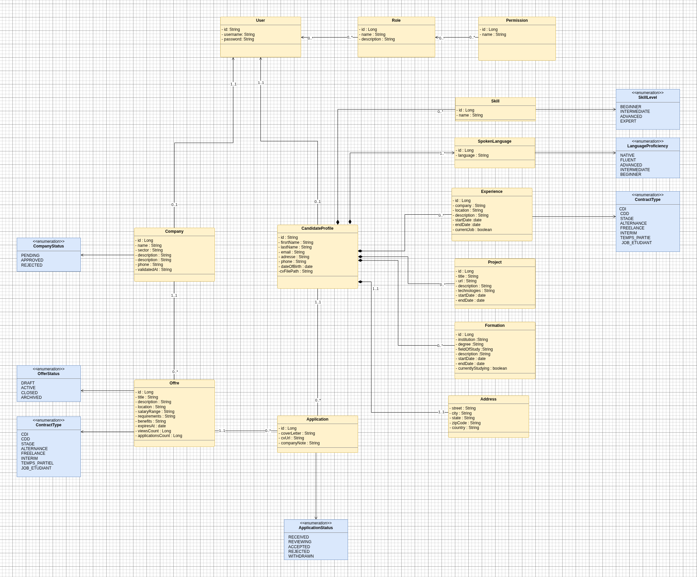
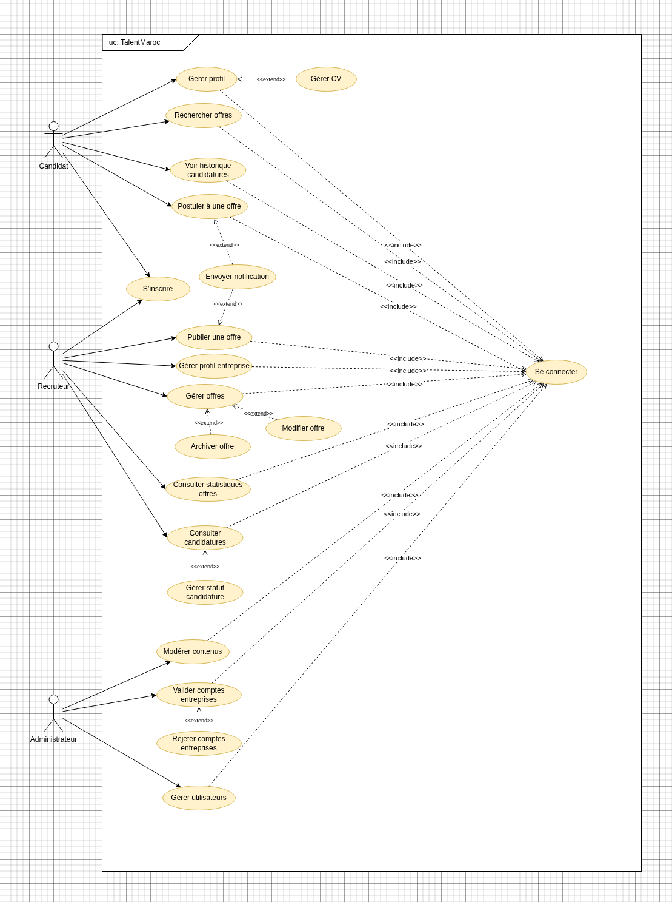

# TalentMaroc

## Platform Overview
TalentMaroc is a full-stack job marketplace that connects candidates, companies, and administrators through a microservice architecture. The platform focuses on reliable offer publication, fast search, guided hiring workflows, and secure account management. Angular powers the web experience, while Spring Boot services handle authentication, profiles, offers, applications, recommendations, and notifications.

## Architecture Highlights
- **Distributed services** with database-per-service boundaries for clear ownership and scaling.
- **Spring Cloud stack**: Config Server, Eureka discovery, and an API Gateway expose a single public entry point.
- **Event-driven notifications** via RabbitMQ for onboarding, password resets, and offer alerts.
- **Angular 21 frontend** with feature-based routing, NgRx state, and reusable UI components for candidate, company, and admin dashboards.
- **PostgreSQL** for all bounded contexts plus persistent storage for uploaded CVs.
- **Container-first** delivery using Dockerfiles per service and a root-level `docker-compose.yml` for local orchestration.

## Architecture Diagrams
- High-level component view:

  

- Core use cases and user journeys:

  

## Service Catalog
| Service | Path | Default Port | Responsibilities |
| --- | --- | --- | --- |
| Config Server | `config-server/` | 8888 | Centralized configuration pushed to every Spring Boot service.
| Discovery Server | `discovery-server/` | 8761 | Eureka registry for service discovery.
| API Gateway | `gateways/api-gateway/` | 8080 | Single public API endpoint with routing, auth headers, and CORS policies.
| Auth User Service | `services/auth-user/` | 8081 | User registration (candidate/company/admin), login, OAuth providers, password reset, email verification.
| Candidate Profile Service | `services/candidate-profile/` | 8090 | Candidate resumes, experiences, uploads, and profile completion tracking.
| Company Offers Service | `services/company-offers/` | 8091 | Company accounts, job offers, statistics, saved jobs, and moderation status.
| Applications Service | `services/applications/` | 8092 | Candidate applications, workflow status, and coordination with offers service.
| Notifications Service | `services/notifications/` | 8093 | Consumes RabbitMQ events and sends transactional emails (verification, reset, offer updates).
| Frontend | `frontend/` | 4200 (dev) | Angular SPA with candidate, company, and admin workspaces.

## Frontend Structure
- `src/app/features/auth`: Email/password + OAuth flows, verification, reset, and session utilities.
- `src/app/features/candidate-dashboard`: Applications, saved jobs, profile enrichment, analytics widgets.
- `src/app/features/company-dashboard`: Offer creation, pipelines, team collaboration, analytics.
- `src/app/features/dashboard/admin-dashboard`: Moderation queues, company validations, platform metrics, messaging tools.
- `src/app/shared`: Design system (layout shells, typography, buttons, icons, form controls, confirm dialogs).
- `src/app/state`: Global NgRx stores (auth, roles, saved jobs, applications, admin entities).

## Messaging and Integrations
- **RabbitMQ** (management UI on `http://localhost:15672`, default `guest/guest`) transports notification events.
- **OAuth providers** (Google, GitHub) configured in the auth service for social sign-in.
- **Email service** credentials loaded by `notifications-service` for transactional emails.

## Prerequisites
- JDK 17+
- Node.js 20+ / npm 10+
- Docker Desktop / Engine 24+
- Maven Wrapper (already committed)
- Modern browser (Chrome, Edge, or Firefox) for Angular dev server

## Environment Variables
Create a `.env` next to `docker-compose.yml` (or export in your shell) with at least:
```
JWT_SECRET=change-me
MAIL_USERNAME=your-smtp-user
MAIL_PASSWORD=your-smtp-password
GOOGLE_CLIENT_ID=...
GOOGLE_CLIENT_SECRET=...
GITHUB_CLIENT_ID=...
GITHUB_CLIENT_SECRET=...
```
These values are injected into the containers by Compose at runtime.

## Quick Start with Docker Compose
1. Build and launch everything:
   ```bash
   docker compose up --build
   ```
2. Access points:
   - API Gateway: `http://localhost:8080`
   - Angular dev build (after `npm run start`): `http://localhost:4200`
   - RabbitMQ UI: `http://localhost:15672`
   - Eureka dashboard: `http://localhost:8761`
3. Stop the stack:
   ```bash
   docker compose down -v
   ```

## Frontend Development Workflow
```bash
cd frontend
npm install
npm run start   # Angular dev server with HMR
npm run lint    # ESLint + Angular template lint
npm run test    # Karma/Jest unit tests
npm run build   # Production build written to dist/
```
Environment endpoints are configured in `src/environments/*.ts`. Update gateway URLs or feature flags there.

## Backend Development Workflow
Each service ships with the Maven wrapper:
```bash
cd services/auth-user
./mvnw clean verify
./mvnw spring-boot:run
```
Repeat for other services (`candidate-profile`, `company-offers`, `applications`, `notifications`). Run databases via Docker Compose or local Postgres instances. JVM debug ports can be enabled by extending the service Dockerfiles or launching from your IDE.

## Testing & Quality Gates
- **Unit / Integration tests**: `./mvnw clean verify` per microservice.
- **Frontend unit tests**: `npm run test`.
- **End-to-end (optional)**: add Playwright/Cypress under `frontend/e2e` and wire into CI.
- **Static analysis**: enable `npm run lint` and `./mvnw checkstyle:check` inside CI to catch regressions before merging.

## API Gateway & Security
- JWT propagation enforced by the gateway; downstream services extract `userId`, `role`, and expiration.
- Role-based guards (candidate, company, admin) enforced both in Angular routes and Spring Security filters.
- HTTPS termination is handled by the upstream load balancer in production; locally the gateway runs over HTTP.

## Observability & Operations
- Spring Boot Actuator is enabled on every service (`/actuator/health`, `/actuator/info`).
- Health checks in `docker-compose.yml` keep dependent services from starting before prerequisites are healthy.
- Logs surface structured JSON; forward them to ELK/OpenSearch in production.

## Deployment Notes
- The repository is container-ready; CI/CD (e.g., GitHub Actions) can build each service image and push to a registry.
- Use the provided Compose file for developer parity; production deployments should rely on Kubernetes or ECS with managed Postgres and RabbitMQ.
- Persisted volumes: `candidate-cv-uploads` stores uploaded CVs. Back up or mount an external volume in production.

## Contributing
1. Fork and create a feature branch (`git checkout -b feature/<name>`).
2. Keep commits scoped (frontend vs backend).
3. Run the relevant test suites before opening a PR.
4. Document new endpoints in the API reference (see `services/*/src/main/resources` for OpenAPI definitions).

Questions or proposals? Open an issue detailing the feature, affected services, and acceptance criteria so reviewers can react quickly.
